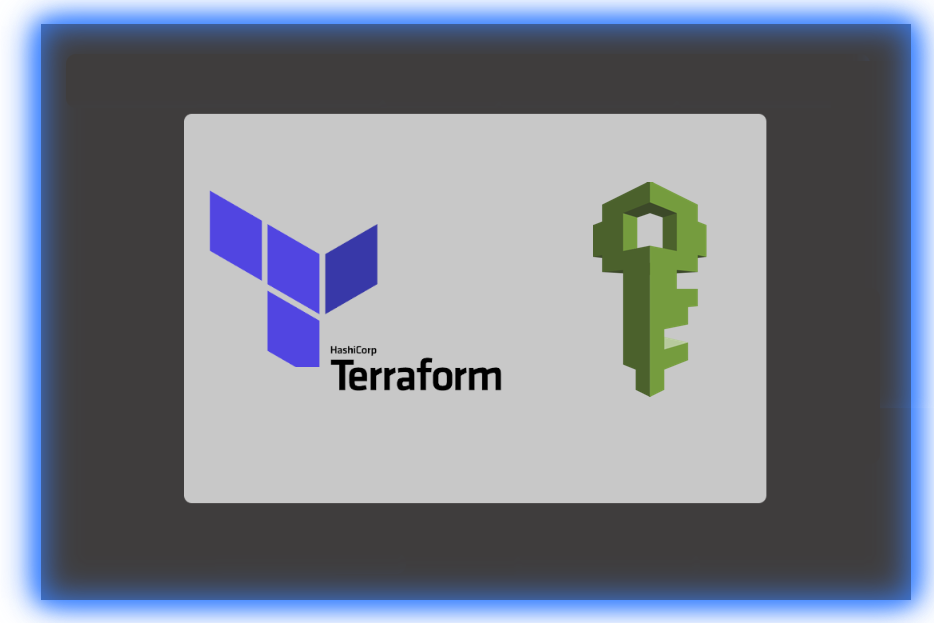
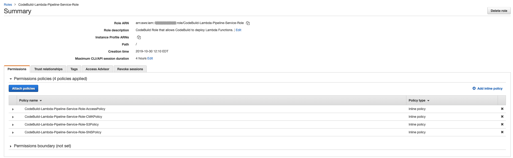

<!-- VSCode Markdown Exclusions-->
<!-- markdownlint-disable MD025 Single Title Headers-->
# Terraform CodeBuild Lambda Deployment Pipeline Role Module



<br>

# Getting Started

This AWS IAM Role module is designed to produce a CodeBuild IAM role that will be applied to the Lambda Deployment Pipeline CodeBuild Job. The Lambda Deployment Pipeline will have the ability to optionally pull and put Lambda packages on S3, Send SNS Topic notifications and build and deploy Lambda functions in a CI/CD pipeline, allowing code update on-demand or via webhook triggers. This role will give the required permissions to necessary EC2 resources that CodeBuild needs to operate within a VPC, access to CloudWatch Logging, Lambda, and STS PassRole. It will also optionally assign permissions to S3 buckets, SNS Topics and KMS CMKs provided the corresponding variables are supplied to the module.

<br><br>

# Module Pre-Requisites and Dependencies

This module does not currently have any pre-requisites or dependency requirements.

<br><br>

# Module Usage

```terraform
module "codebuild_lambda_deployment_role" {
  source = "git@github.com:CloudMage-TF/AWS-CodeBuild-Lambda-Deployment-Pipeline-Role-Module.git?ref=v1.0.3"

  // Required Variables
  codebuild_role_name                  = "Codebuild-Lambda-Role"
  codebuild_role_description           = "CodeBuild Role Description would go here"
  
  // Optional Variables with module defined default values assigned
  # codebuild_role_s3_resource_access  = []
  # codebuild_sns_resource_access      = []
  # codebuild_cmk_resource_access      = []

  // Tags
  # codebuild_role_tags                = {
  #   Provisoned_By  = "Terraform"
  #   GitHub_URL     = "https://github.com/CloudMage-TF/AWS-KMS-Module.git"
  # }
}
```

<br><br>

# Terraform Variables

Module variables that need to either be defined or re-defined with a non-default value can easily be hardcoded inline directly within the module call block or from within the root project that is consuming the module. If using the second approach then the root project must have it's own custom variables defined within the projects `variables.tf` file with set default values or with the values provided from a separate environmental `terraform.tfvar` file. Examples of both approaches can be found below. Note that for the standards used within this documentation, all variables will mostly use the first approach for ease of readability.

<br>

> __NOTE:__ There is also a third way to provide variable values using Terraform data sources. A data source is a unique type of code block used within a project that either instantiates or collects data that can be referenced throughout the project. A data source, for example,  can be declared to read the terraform state file and gather all of the available information from a previously deployed project stack. Any of the data contained within the data source can then be referenced to set the value of a project or module variable.

<br><br>

## Setting Variables Inline

```terraform
module "codebuild_lambda_deployment_role" {
  source = "git@github.com:CloudMage-TF/AWS-CodeBuild-Lambda-Deployment-Pipeline-Role-Module.git?ref=v1.0.3"

  // Required Variables
  codebuild_role_name = "Codebuild-Lambda-Role"
}
```

<br><br>

## Setting Variables in a Terraform Root Project

<br>

### Terraform Root Project/variables.tf

```terraform
variable "role_name" {
  type        = string
  description = "Meaningful Description"
}
```

<br>

### Terraform Root Project/terraform.tfvars

```terraform
role_name = "Codebuild-Lambda-Role"
```

<br>

### Terraform Root Project/main.tf

```terraform
module "codebuild_lambda_deployment_role" {
  source = "git@github.com:CloudMage-TF/AWS-CodeBuild-Lambda-Deployment-Pipeline-Role-Module.git?ref=v1.0.3"

  // Required Variables
  codebuild_role_name  = var.role_name
}
```

<br><br>

# Required Variables

This module does not have any required variables. The module can be called without passing any arguments to it, and the module will spin up the IAM role resources using all of the default values.

<br><br>

## Base Module Execution

Once all of the modules required values have been assigned, then the module can be executed in its base capacity.

<br><br>

### Module usage in project root main.tf

```terraform
module "codebuild_lambda_deployment_role" {
  source = "git@github.com:CloudMage-TF/AWS-CodeBuild-Lambda-Deployment-Pipeline-Role-Module.git?ref=v1.0.3"

  // This Module has No Required Variables
}
```

<br><br>

### Generated IAM Role Policy

Without defining values for any optional module variables, an IAM policy with the following permissions will be created automatically and applied to the requested CodeBuild IAM Role during module execution.

```yaml
CloudMage-CodeBuild-Lambda-Deployment-Role:
  AssumeRolePolicyDocument:
    Version: '2012-10-17'
    Statement:
      - Effect: Allow
        Principal:
          Service:
            - codebuild.amazonaws.com
        Action: sts:AssumeRole
  Policies:
    - PolicyName: CloudMage-CodeBuild-Lambda-Deployment-Role-AccessPolicy
      PolicyDocument:
      Version: '2012-10-17'
      Statement:
        - Sid: LambdaPipelineLogAccess
          Effect: Allow
          Action:
            - logs:PutLogEvents
            - logs:CreateLogStream
            - logs:CreateLogGroup
          Resource: "*"
        - Sid: LambdaPipelineEC2Access
          Effect: Allow
          Action:
            - ec2:DescribeVpcs
            - ec2:DescribeSubnets
            - ec2:DescribeSecurityGroups
            - ec2:DescribeNetworkInterfaces
            - ec2:DescribeDhcpOptions
            - ec2:DeleteNetworkInterface
            - ec2:CreateNetworkInterfacePermission
            - ec2:CreateNetworkInterface
          Resource: "*"
        - Sid: LambdaPipelineLambdaAccess
          Effect: Allow
          Action:
            - lambda:*
          Resource: "*"
        - Sid: LambdaPipelinePassRole
          Effect: Allow
          Action:
            - iam:PassRole
          Resource: "*"
```

<br><br>

### Example `terraform plan` output

```terraform
Refreshing Terraform state in-memory prior to plan...
The refreshed state will be used to calculate this plan, but will not be
persisted to local or remote state storage.

module.demo_codebuild_role.data.aws_caller_identity.current: Refreshing state...
module.demo_codebuild_role.data.aws_iam_policy_document.principal_policy: Refreshing state...
module.demo_codebuild_role.data.aws_iam_policy_document.access_policy: Refreshing state...

------------------------------------------------------------------------

An execution plan has been generated and is shown below.
Resource actions are indicated with the following symbols:
  + create

Terraform will perform the following actions:

  # module.demo_codebuild_role.aws_iam_role.this will be created
  + resource "aws_iam_role" "this" {
      + arn                   = (known after apply)
      + assume_role_policy    = jsonencode(
            {
              + Statement = [
                  + {
                      + Action    = "sts:AssumeRole"
                      + Effect    = "Allow"
                      + Principal = {
                          + Service = "codebuild.amazonaws.com"
                        }
                      + Sid       = ""
                    },
                ]
              + Version   = "2012-10-17"
            }
        )
      + create_date           = (known after apply)
      + description           = "CodeBuild Role that allows CodeBuild to deploy Lambda Functions."
      + force_detach_policies = false
      + id                    = (known after apply)
      + max_session_duration  = 14400
      + name                  = "CodeBuild-Lambda-Pipeline-Service-Role"
      + path                  = "/"
      + unique_id             = (known after apply)
    }

  # module.demo_codebuild_role.aws_iam_role_policy.access_policy will be created
  + resource "aws_iam_role_policy" "access_policy" {
      + id     = (known after apply)
      + name   = "CodeBuild-Lambda-Pipeline-Service-Role-AccessPolicy"
      + policy = jsonencode(
            {
              + Statement = [
                  + {
                      + Action   = [
                          + "logs:PutLogEvents",
                          + "logs:CreateLogStream",
                          + "logs:CreateLogGroup",
                        ]
                      + Effect   = "Allow"
                      + Resource = "*"
                      + Sid      = "LambdaPipelineLogAccess"
                    },
                  + {
                      + Action   = [
                          + "ec2:DescribeVpcs",
                          + "ec2:DescribeSubnets",
                          + "ec2:DescribeSecurityGroups",
                          + "ec2:DescribeNetworkInterfaces",
                          + "ec2:DescribeDhcpOptions",
                          + "ec2:DeleteNetworkInterface",
                          + "ec2:CreateNetworkInterfacePermission",
                          + "ec2:CreateNetworkInterface",
                        ]
                      + Effect   = "Allow"
                      + Resource = "*"
                      + Sid      = "LambdaPipelineEC2Access"
                    },
                  + {
                      + Action   = "lambda:*"
                      + Effect   = "Allow"
                      + Resource = "*"
                      + Sid      = "LambdaPipelineLambdaAccess"
                    },
                  + {
                      + Action   = "iam:PassRole"
                      + Effect   = "Allow"
                      + Resource = "*"
                      + Sid      = "LambdaPipelinePassRole"
                    },
                ]
              + Version   = "2012-10-17"
            }
        )
      + role   = (known after apply)
    }

Plan: 2 to add, 0 to change, 0 to destroy.

------------------------------------------------------------------------

Note: You didn't specify an "-out" parameter to save this plan, so Terraform
can't guarantee that exactly these actions will be performed if
"terraform apply" is subsequently run.
```

<br><br>

# Optional Variables

The following optional module variables are not required because they already have default values assigned when the variables where defined within the modules `variables.tf` file. If the default values do not need to be changed by the root project consuming the module, then they do not even need to be included in the root project. If any of the variables do need to be changed, then they can be added to the root project in the same way that the required variables were defined and utilized. Optional variables also may alter how the module provisions resources in the cases of encryption or IAM policy generation. A variable could flag an encryption requirement when provisioning an S3 bucket or Dynamo table by providing a KMS CMK, for example. Another use case may be the passage of ARN values to allow users or roles access to services or resources, whereas by default permissions would be more restrictive or only assigned to the account root or a single IAM role. A detailed explanation of each of this modules optional variables can be found below:

<br><br>

## :large_blue_circle: codebuild_role_name

<br>


<br>

This variable can be used to customize the name of the Lambda CodeBuild Deployment Role that will be provisioned. If this value is not defined, then the CodeBuild Role name will be set to `CodeBuild-Lambda-Pipeline-Service-Role`.

<br><br>

### Declaration in module variables.tf

```terraform
variable "codebuild_role_name" {
  type        = string
  description = "Specify a name for the the Lambda Pipeline Service Role."
  default     = "CodeBuild-Lambda-Pipeline-Service-Role"
}
```

<br><br>

### Module usage in project root main.tf

```terraform
module "codebuild_lambda_deployment_role" {
  source = "git@github.com:CloudMage-TF/AWS-CodeBuild-Lambda-Deployment-Pipeline-Role-Module.git?ref=v1.0.3"

  // Required Variables
  codebuild_role_name                = "CodeBuild-Lambda-Deploy-Role"
}
```

<br><br>

### Example `terraform plan` output

```terraform
Refreshing Terraform state in-memory prior to plan...
The refreshed state will be used to calculate this plan, but will not be
persisted to local or remote state storage.

module.demo_codebuild_role.data.aws_caller_identity.current: Refreshing state...
module.demo_codebuild_role.data.aws_iam_policy_document.principal_policy: Refreshing state...
module.demo_codebuild_role.data.aws_iam_policy_document.access_policy: Refreshing state...

------------------------------------------------------------------------

An execution plan has been generated and is shown below.
Resource actions are indicated with the following symbols:
  + create

Terraform will perform the following actions:

  # module.demo_codebuild_role.aws_iam_role.this will be created
  + resource "aws_iam_role" "this" {
      + arn                   = (known after apply)
      + assume_role_policy    = jsonencode(
            {
              + Statement = [
                  + {
                      + Action    = "sts:AssumeRole"
                      + Effect    = "Allow"
                      + Principal = {
                          + Service = "codebuild.amazonaws.com"
                        }
                      + Sid       = ""
                    },
                ]
              + Version   = "2012-10-17"
            }
        )
      + create_date           = (known after apply)
      + description           = "CodeBuild Role that allows CodeBuild to deploy Lambda Functions."
      + force_detach_policies = false
      + id                    = (known after apply)
      + max_session_duration  = 14400
      + name                  = "CodeBuild-Lambda-Deploy-Role"
      + path                  = "/"
      + unique_id             = (known after apply)
    }

  # module.demo_codebuild_role.aws_iam_role_policy.access_policy will be created
  + resource "aws_iam_role_policy" "access_policy" {
      + id     = (known after apply)
      + name   = "CodeBuild-Lambda-Deploy-Role-AccessPolicy"
      + policy = jsonencode(
            {
              + Statement = [
                  + {
                      + Action   = [
                          + "logs:PutLogEvents",
                          + "logs:CreateLogStream",
                          + "logs:CreateLogGroup",
                        ]
                      + Effect   = "Allow"
                      + Resource = "*"
                      + Sid      = "LambdaPipelineLogAccess"
                    },
                  + {
                      + Action   = [
                          + "ec2:DescribeVpcs",
                          + "ec2:DescribeSubnets",
                          + "ec2:DescribeSecurityGroups",
                          + "ec2:DescribeNetworkInterfaces",
                          + "ec2:DescribeDhcpOptions",
                          + "ec2:DeleteNetworkInterface",
                          + "ec2:CreateNetworkInterfacePermission",
                          + "ec2:CreateNetworkInterface",
                        ]
                      + Effect   = "Allow"
                      + Resource = "*"
                      + Sid      = "LambdaPipelineEC2Access"
                    },
                  + {
                      + Action   = "lambda:*"
                      + Effect   = "Allow"
                      + Resource = "*"
                      + Sid      = "LambdaPipelineLambdaAccess"
                    },
                  + {
                      + Action   = "iam:PassRole"
                      + Effect   = "Allow"
                      + Resource = "*"
                      + Sid      = "LambdaPipelinePassRole"
                    },
                ]
              + Version   = "2012-10-17"
            }
        )
      + role   = (known after apply)
    }

Plan: 2 to add, 0 to change, 0 to destroy.

------------------------------------------------------------------------

Note: You didn't specify an "-out" parameter to save this plan, so Terraform
can't guarantee that exactly these actions will be performed if
"terraform apply" is subsequently run.
```

<br><br><br>

## :large_blue_circle: codebuild_role_description

<br>


<br>

This variable can be used to customize the description of the Lambda CodeBuild Deployment Role that will be provisioned. If this value is not defined, then the CodeBuild Role description will be set to `CodeBuild Role that allows CodeBuild to deploy Lambda Functions.`.

<br><br>

### Declaration in module variables.tf

```terraform
variable "codebuild_role_description" {
  type        = string
  description = "Specify the description for the the Lambda Pipeline Service Role."
  default     = "CodeBuild Role that allows CodeBuild to deploy Lambda Functions."
}
```

<br><br>

### Module usage in project root main.tf

```terraform
module "codebuild_lambda_deployment_role" {
  source = "git@github.com:CloudMage-TF/AWS-CodeBuild-Lambda-Deployment-Pipeline-Role-Module.git?ref=v1.0.3"

  // Required Variables
  codebuild_role_name        = "CloudMage-CodeBuild-Lambda-Deployment-Role"
  codebuild_role_description = "This role is used by codebuild to deploy lambdas for applications app_a, app_b, and app_c."
}
```

<br><br>

### Example `terraform plan` output

```terraform
Refreshing Terraform state in-memory prior to plan...
The refreshed state will be used to calculate this plan, but will not be
persisted to local or remote state storage.

module.demo_codebuild_role.data.aws_caller_identity.current: Refreshing state...
module.demo_codebuild_role.data.aws_iam_policy_document.principal_policy: Refreshing state...
module.demo_codebuild_role.data.aws_iam_policy_document.access_policy: Refreshing state...

------------------------------------------------------------------------

An execution plan has been generated and is shown below.
Resource actions are indicated with the following symbols:
  + create

Terraform will perform the following actions:

  # module.demo_codebuild_role.aws_iam_role.this will be created
  + resource "aws_iam_role" "this" {
      + arn                   = (known after apply)
      + assume_role_policy    = jsonencode(
            {
              + Statement = [
                  + {
                      + Action    = "sts:AssumeRole"
                      + Effect    = "Allow"
                      + Principal = {
                          + Service = "codebuild.amazonaws.com"
                        }
                      + Sid       = ""
                    },
                ]
              + Version   = "2012-10-17"
            }
        )
      + create_date           = (known after apply)
      + description           = "This role is used by codebuild to deploy lambdas for applications app_a, app_b, and app_c."
      + force_detach_policies = false
      + id                    = (known after apply)
      + max_session_duration  = 14400
      + name                  = "CloudMage-CodeBuild-Lambda-Deployment-Role"
      + path                  = "/"
      + unique_id             = (known after apply)
    }

  # module.demo_codebuild_role.aws_iam_role_policy.access_policy will be created
  + resource "aws_iam_role_policy" "access_policy" {
      + id     = (known after apply)
      + name   = "CloudMage-CodeBuild-Lambda-Deployment-Role-AccessPolicy"
      + policy = jsonencode(
            {
              + Statement = [
                  + {
                      + Action   = [
                          + "logs:PutLogEvents",
                          + "logs:CreateLogStream",
                          + "logs:CreateLogGroup",
                        ]
                      + Effect   = "Allow"
                      + Resource = "*"
                      + Sid      = "LambdaPipelineLogAccess"
                    },
                  + {
                      + Action   = [
                          + "ec2:DescribeVpcs",
                          + "ec2:DescribeSubnets",
                          + "ec2:DescribeSecurityGroups",
                          + "ec2:DescribeNetworkInterfaces",
                          + "ec2:DescribeDhcpOptions",
                          + "ec2:DeleteNetworkInterface",
                          + "ec2:CreateNetworkInterfacePermission",
                          + "ec2:CreateNetworkInterface",
                        ]
                      + Effect   = "Allow"
                      + Resource = "*"
                      + Sid      = "LambdaPipelineEC2Access"
                    },
                  + {
                      + Action   = "lambda:*"
                      + Effect   = "Allow"
                      + Resource = "*"
                      + Sid      = "LambdaPipelineLambdaAccess"
                    },
                  + {
                      + Action   = "iam:PassRole"
                      + Effect   = "Allow"
                      + Resource = "*"
                      + Sid      = "LambdaPipelinePassRole"
                    },
                ]
              + Version   = "2012-10-17"
            }
        )
      + role   = (known after apply)
    }

Plan: 2 to add, 0 to change, 0 to destroy.

------------------------------------------------------------------------

Note: You didn't specify an "-out" parameter to save this plan, so Terraform
can't guarantee that exactly these actions will be performed if
"terraform apply" is subsequently run.
```

<br><br><br>

## :large_blue_circle: codebuild_role_s3_resource_access

<br>


<br>

This variable can contain a list of AWS S3 Bucket ARNs that the CodeBuild Role will be given **CRUD** access to. For each bucket ARN provided, the module will create an IAM policy document that will automatically contain a wildcard entry along with the original bucket ARN. `["arn:aws:s3:::bucket", "arn:aws:s3:::bucket/*"]`

<br><br>

### Declaration in module variables.tf

```terraform
variable "codebuild_role_s3_resource_access" {
  type        = list(string)
  description = "List of S3 Bucket ARNs that the CodeBuild Lambda Pipeline Service Role will be given access to."
  default     = []
}
```

<br><br>

### Module usage in project root main.tf

```terraform
module "codebuild_lambda_deployment_role" {
  source = "git@github.com:CloudMage-TF/AWS-CodeBuild-Lambda-Deployment-Pipeline-Role-Module.git?ref=v1.0.3"

  // Required Variables
  codebuild_role_name                = "CloudMage-CodeBuild-Lambda-Deployment-Role"
  codebuild_role_description         = "This role is used by codebuild to deploy lambdas for applications app_a, app_b, and app_c."
  codebuild_role_s3_resource_access  = ["arn:aws:s3:::kms-encrypted-demo-bucket", "arn:aws:s3:::demo-lambda-deploy-bucket"]
}
```

<br><br>

### Generated IAM S3 Access Policy

```yaml
Statement:
  - Sid: "LambdaPipelineS3Access"
    Effect: Allow
    Action:
      - "s3:PutObjectVersionTagging"
      - "s3:PutObjectTagging"
      - "s3:PutObject"
      - "s3:ListBucket"
      - "s3:GetObjectVersion"
      - "s3:GetObject"
      - "s3:GetBucketLocation"
      - "s3:GetBucketAcl"
      - "s3:DeleteObject"
    Resources:
      - "arn:aws:s3:::kms-encrypted-demo-bucket"
      - "arn:aws:s3:::kms-encrypted-demo-bucket/*"
      - "arn:aws:s3:::demo-lambda-deploy-bucket"
      - "arn:aws:s3:::demo-lambda-deploy-bucket/*"
```

<br><br>

### Example `terraform plan` output

```terraform
Refreshing Terraform state in-memory prior to plan...
The refreshed state will be used to calculate this plan, but will not be
persisted to local or remote state storage.

module.demo_codebuild_role.data.aws_caller_identity.current: Refreshing state...
module.demo_codebuild_role.data.aws_iam_policy_document.principal_policy: Refreshing state...
module.demo_codebuild_role.data.aws_iam_policy_document.access_policy: Refreshing state...
module.demo_codebuild_role.data.aws_iam_policy_document.s3_policy[0]: Refreshing state...

------------------------------------------------------------------------

An execution plan has been generated and is shown below.
Resource actions are indicated with the following symbols:
  + create

Terraform will perform the following actions:

  # module.demo_codebuild_role.aws_iam_role.this will be created
  + resource "aws_iam_role" "this" {
      + arn                   = (known after apply)
      + assume_role_policy    = jsonencode(
            {
              + Statement = [
                  + {
                      + Action    = "sts:AssumeRole"
                      + Effect    = "Allow"
                      + Principal = {
                          + Service = "codebuild.amazonaws.com"
                        }
                      + Sid       = ""
                    },
                ]
              + Version   = "2012-10-17"
            }
        )
      + create_date           = (known after apply)
      + description           = "This role is used by codebuild to deploy lambdas for applications app_a, app_b, and app_c."
      + force_detach_policies = false
      + id                    = (known after apply)
      + max_session_duration  = 14400
      + name                  = "CloudMage-CodeBuild-Lambda-Deployment-Role"
      + path                  = "/"
      + unique_id             = (known after apply)
    }

  # module.demo_codebuild_role.aws_iam_role_policy.access_policy will be created
  + resource "aws_iam_role_policy" "access_policy" {
      + id     = (known after apply)
      + name   = "CloudMage-CodeBuild-Lambda-Deployment-Role-AccessPolicy"
      + policy = jsonencode(
            {
              + Statement = [
                  + {
                      + Action   = [
                          + "logs:PutLogEvents",
                          + "logs:CreateLogStream",
                          + "logs:CreateLogGroup",
                        ]
                      + Effect   = "Allow"
                      + Resource = "*"
                      + Sid      = "LambdaPipelineLogAccess"
                    },
                  + {
                      + Action   = [
                          + "ec2:DescribeVpcs",
                          + "ec2:DescribeSubnets",
                          + "ec2:DescribeSecurityGroups",
                          + "ec2:DescribeNetworkInterfaces",
                          + "ec2:DescribeDhcpOptions",
                          + "ec2:DeleteNetworkInterface",
                          + "ec2:CreateNetworkInterfacePermission",
                          + "ec2:CreateNetworkInterface",
                        ]
                      + Effect   = "Allow"
                      + Resource = "*"
                      + Sid      = "LambdaPipelineEC2Access"
                    },
                  + {
                      + Action   = "lambda:*"
                      + Effect   = "Allow"
                      + Resource = "*"
                      + Sid      = "LambdaPipelineLambdaAccess"
                    },
                  + {
                      + Action   = "iam:PassRole"
                      + Effect   = "Allow"
                      + Resource = "*"
                      + Sid      = "LambdaPipelinePassRole"
                    },
                ]
              + Version   = "2012-10-17"
            }
        )
      + role   = (known after apply)
    }

  # module.demo_codebuild_role.aws_iam_role_policy.s3_policy[0] will be created
  + resource "aws_iam_role_policy" "s3_policy" {
      + id     = (known after apply)
      + name   = "CloudMage-CodeBuild-Lambda-Deployment-Role-S3Policy"
      + policy = jsonencode(
            {
              + Statement = [
                  + {
                      + Action   = [
                          + "s3:PutObjectVersionTagging",
                          + "s3:PutObjectTagging",
                          + "s3:PutObject",
                          + "s3:ListBucket",
                          + "s3:GetObjectVersion",
                          + "s3:GetObject",
                          + "s3:GetBucketLocation",
                          + "s3:GetBucketAcl",
                          + "s3:DeleteObject",
                        ]
                      + Effect   = "Allow"
                      + Resource = [
                          + "arn:aws:s3:::kms-encrypted-demo-bucket/*",
                          + "arn:aws:s3:::kms-encrypted-demo-bucket",
                          + "arn:aws:s3:::demo-lambda-deploy-bucket/*",
                          + "arn:aws:s3:::demo-lambda-deploy-bucket",
                        ]
                      + Sid      = "LambdaPipelineS3Access"
                    },
                ]
              + Version   = "2012-10-17"
            }
        )
      + role   = (known after apply)
    }

Plan: 3 to add, 0 to change, 0 to destroy.

------------------------------------------------------------------------

Note: You didn't specify an "-out" parameter to save this plan, so Terraform
can't guarantee that exactly these actions will be performed if
"terraform apply" is subsequently run.
```

<br><br><br>

## :large_blue_circle: codebuild_sns_resource_access

<br>


<br>

This variable can contain a list of AWS SNS Topic ARNs that the CodeBuild Role will be given **Publish** access to allow event notification alerting.

<br><br>

### Declaration in module variables.tf

```terraform
variable "codebuild_sns_resource_access" {
  type        = list(string)
  description = "List of SNS Topic ARNs that the CodeBuild Lambda Pipeline Service Role will be given access to."
  default     = []
}
```

<br><br>

### Module usage in project root main.tf

```terraform
module "codebuild_lambda_deployment_role" {
  source = "git@github.com:CloudMage-TF/AWS-CodeBuild-Lambda-Deployment-Pipeline-Role-Module.git?ref=v1.0.3"

  // Required Variables
  codebuild_role_name               = "CloudMage-CodeBuild-Lambda-Deployment-Role"
  codebuild_role_description        = "This role is used by codebuild to deploy lambdas for applications app_a, app_b, and app_c."
  codebuild_sns_resource_access     = ["arn:aws:sns:::CodeBuild-Notification-Topic"]

  // Optional Variables with module defined default values assigned
  # codebuild_role_s3_resource_access = []
}
```

<br><br>

### Generated IAM S3 Access Policy

```yaml
Statement:
  - Sid: "LambdaPipelineSNSAccess"
    Effect: Allow
    Action:
      - "sns:Publish"
    Resources:
      - "arn:aws:sns:::CodeBuild-Notification-Topic"
```

<br><br>

### Example `terraform plan` output

```terraform
Refreshing Terraform state in-memory prior to plan...
The refreshed state will be used to calculate this plan, but will not be
persisted to local or remote state storage.

module.demo_codebuild_role.data.aws_caller_identity.current: Refreshing state...
module.demo_codebuild_role.data.aws_iam_policy_document.sns_policy[0]: Refreshing state...
module.demo_codebuild_role.data.aws_iam_policy_document.principal_policy: Refreshing state...
module.demo_codebuild_role.data.aws_iam_policy_document.access_policy: Refreshing state...

------------------------------------------------------------------------

An execution plan has been generated and is shown below.
Resource actions are indicated with the following symbols:
  + create

Terraform will perform the following actions:

  # module.demo_codebuild_role.aws_iam_role.this will be created
  + resource "aws_iam_role" "this" {
      + arn                   = (known after apply)
      + assume_role_policy    = jsonencode(
            {
              + Statement = [
                  + {
                      + Action    = "sts:AssumeRole"
                      + Effect    = "Allow"
                      + Principal = {
                          + Service = "codebuild.amazonaws.com"
                        }
                      + Sid       = ""
                    },
                ]
              + Version   = "2012-10-17"
            }
        )
      + create_date           = (known after apply)
      + description           = "This role is used by codebuild to deploy lambdas for applications app_a, app_b, and app_c."
      + force_detach_policies = false
      + id                    = (known after apply)
      + max_session_duration  = 14400
      + name                  = "CloudMage-CodeBuild-Lambda-Deployment-Role"
      + path                  = "/"
      + unique_id             = (known after apply)
    }

  # module.demo_codebuild_role.aws_iam_role_policy.access_policy will be created
  + resource "aws_iam_role_policy" "access_policy" {
      + id     = (known after apply)
      + name   = "CloudMage-CodeBuild-Lambda-Deployment-Role-AccessPolicy"
      + policy = jsonencode(
            {
              + Statement = [
                  + {
                      + Action   = [
                          + "logs:PutLogEvents",
                          + "logs:CreateLogStream",
                          + "logs:CreateLogGroup",
                        ]
                      + Effect   = "Allow"
                      + Resource = "*"
                      + Sid      = "LambdaPipelineLogAccess"
                    },
                  + {
                      + Action   = [
                          + "ec2:DescribeVpcs",
                          + "ec2:DescribeSubnets",
                          + "ec2:DescribeSecurityGroups",
                          + "ec2:DescribeNetworkInterfaces",
                          + "ec2:DescribeDhcpOptions",
                          + "ec2:DeleteNetworkInterface",
                          + "ec2:CreateNetworkInterfacePermission",
                          + "ec2:CreateNetworkInterface",
                        ]
                      + Effect   = "Allow"
                      + Resource = "*"
                      + Sid      = "LambdaPipelineEC2Access"
                    },
                  + {
                      + Action   = "lambda:*"
                      + Effect   = "Allow"
                      + Resource = "*"
                      + Sid      = "LambdaPipelineLambdaAccess"
                    },
                  + {
                      + Action   = "iam:PassRole"
                      + Effect   = "Allow"
                      + Resource = "*"
                      + Sid      = "LambdaPipelinePassRole"
                    },
                ]
              + Version   = "2012-10-17"
            }
        )
      + role   = (known after apply)
    }

  # module.demo_codebuild_role.aws_iam_role_policy.sns_policy[0] will be created
  + resource "aws_iam_role_policy" "sns_policy" {
      + id     = (known after apply)
      + name   = "CloudMage-CodeBuild-Lambda-Deployment-Role-SNSPolicy"
      + policy = jsonencode(
            {
              + Statement = [
                  + {
                      + Action   = "sns:Publish"
                      + Effect   = "Allow"
                      + Resource = "arn:aws:sns:::CodeBuild-Notification-Topic"
                      + Sid      = "LambdaPipelineSNSAccess"
                    },
                ]
              + Version   = "2012-10-17"
            }
        )
      + role   = (known after apply)
    }

Plan: 3 to add, 0 to change, 0 to destroy.

------------------------------------------------------------------------

Note: You didn't specify an "-out" parameter to save this plan, so Terraform
can't guarantee that exactly these actions will be performed if
"terraform apply" is subsequently run.
```

<br><br><br>

## :large_blue_circle: codebuild_cmk_resource_access

<br>


<br>

This variable can contain a list of AWS KMS CMK ARNs that the CodeBuild Role will be given usage access to so that it can be allowed to encrypt/decrypt objects stored in an encrypted S3 bucket.

<br><br>

### Declaration in module variables.tf

```terraform
variable "codebuild_cmk_resource_access" {
  type        = list(string)
  description = "Optional - List of KMS CMK ARNs that the CodeBuild Lambda Pipeline Service Role will be given usage permissions to."
  default     = []
}
```

<br><br>

### Module usage in project root main.tf

```terraform
module "codebuild_lambda_deployment_role" {
  source = "git@github.com:CloudMage-TF/AWS-CodeBuild-Lambda-Deployment-Pipeline-Role-Module.git?ref=v1.0.3"

  // Required Variables
  codebuild_role_name               = "CloudMage-CodeBuild-Lambda-Deployment-Role"
  codebuild_role_description        = "This role is used by codebuild to deploy lambdas for applications app_a, app_b, and app_c."
  codebuild_cmk_resource_access     = ["arn:aws:kms:us-east-1:111122223333:key/1234abcd-12ab-34cd-56ef-1234567890ab"]

  // Optional Variables with module defined default values assigned
  # codebuild_role_s3_resource_access = []
  # codebuild_sns_resource_access     = []
}
```

<br><br>

### Generated IAM S3 Access Policy

```yaml
Statement:
  - Sid: "LambdaPipelineCMKAccess"
    Effect: Allow
    Action:
      - "kms:DescribeKey"
      - "kms:Encrypt"
      - "kms:Decrypt"
      - "kms:ReEncrypt*"
      - "kms:GenerateDataKey*"
      - "kms:ListGrants"
      - "kms:CreateGrant"
      - "kms:RetireGrant"
      - "kms:RevokeGrant"
    Resources:
      - "arn:aws:kms:us-east-1:111122223333:key/1234abcd-12ab-34cd-56ef-1234567890ab"
```

<br><br>

### Example `terraform plan` output

```terraform
Refreshing Terraform state in-memory prior to plan...
The refreshed state will be used to calculate this plan, but will not be
persisted to local or remote state storage.

module.demo_codebuild_role.data.aws_caller_identity.current: Refreshing state...
module.demo_codebuild_role.data.aws_iam_policy_document.cmk_policy[0]: Refreshing state...
module.demo_codebuild_role.data.aws_iam_policy_document.principal_policy: Refreshing state...
module.demo_codebuild_role.data.aws_iam_policy_document.access_policy: Refreshing state...

------------------------------------------------------------------------

An execution plan has been generated and is shown below.
Resource actions are indicated with the following symbols:
  + create

Terraform will perform the following actions:

  # module.demo_codebuild_role.aws_iam_role.this will be created
  + resource "aws_iam_role" "this" {
      + arn                   = (known after apply)
      + assume_role_policy    = jsonencode(
            {
              + Statement = [
                  + {
                      + Action    = "sts:AssumeRole"
                      + Effect    = "Allow"
                      + Principal = {
                          + Service = "codebuild.amazonaws.com"
                        }
                      + Sid       = ""
                    },
                ]
              + Version   = "2012-10-17"
            }
        )
      + create_date           = (known after apply)
      + description           = "This role is used by codebuild to deploy lambdas for applications app_a, app_b, and app_c."
      + force_detach_policies = false
      + id                    = (known after apply)
      + max_session_duration  = 14400
      + name                  = "CloudMage-CodeBuild-Lambda-Deployment-Role"
      + path                  = "/"
      + unique_id             = (known after apply)
    }

  # module.demo_codebuild_role.aws_iam_role_policy.access_policy will be created
  + resource "aws_iam_role_policy" "access_policy" {
      + id     = (known after apply)
      + name   = "CloudMage-CodeBuild-Lambda-Deployment-Role-AccessPolicy"
      + policy = jsonencode(
            {
              + Statement = [
                  + {
                      + Action   = [
                          + "logs:PutLogEvents",
                          + "logs:CreateLogStream",
                          + "logs:CreateLogGroup",
                        ]
                      + Effect   = "Allow"
                      + Resource = "*"
                      + Sid      = "LambdaPipelineLogAccess"
                    },
                  + {
                      + Action   = [
                          + "ec2:DescribeVpcs",
                          + "ec2:DescribeSubnets",
                          + "ec2:DescribeSecurityGroups",
                          + "ec2:DescribeNetworkInterfaces",
                          + "ec2:DescribeDhcpOptions",
                          + "ec2:DeleteNetworkInterface",
                          + "ec2:CreateNetworkInterfacePermission",
                          + "ec2:CreateNetworkInterface",
                        ]
                      + Effect   = "Allow"
                      + Resource = "*"
                      + Sid      = "LambdaPipelineEC2Access"
                    },
                  + {
                      + Action   = "lambda:*"
                      + Effect   = "Allow"
                      + Resource = "*"
                      + Sid      = "LambdaPipelineLambdaAccess"
                    },
                  + {
                      + Action   = "iam:PassRole"
                      + Effect   = "Allow"
                      + Resource = "*"
                      + Sid      = "LambdaPipelinePassRole"
                    },
                ]
              + Version   = "2012-10-17"
            }
        )
      + role   = (known after apply)
    }

  # module.demo_codebuild_role.aws_iam_role_policy.cmk_policy[0] will be created
  + resource "aws_iam_role_policy" "cmk_policy" {
      + id     = (known after apply)
      + name   = "CloudMage-CodeBuild-Lambda-Deployment-Role-CMKPolicy"
      + policy = jsonencode(
            {
              + Statement = [
                  + {
                      + Action   = [
                          + "kms:RevokeGrant",
                          + "kms:RetireGrant",
                          + "kms:ReEncrypt*",
                          + "kms:ListGrants",
                          + "kms:GenerateDataKey*",
                          + "kms:Encrypt",
                          + "kms:DescribeKey",
                          + "kms:Decrypt",
                          + "kms:CreateGrant",
                        ]
                      + Effect   = "Allow"
                      + Resource = "arn:aws:kms:us-east-1:111122223333:key/1234abcd-12ab-34cd-56ef-1234567890ab"
                      + Sid      = "LambdaPipelineCMKAccess"
                    },
                ]
              + Version   = "2012-10-17"
            }
        )
      + role   = (known after apply)
    }

Plan: 3 to add, 0 to change, 0 to destroy.

------------------------------------------------------------------------

Note: You didn't specify an "-out" parameter to save this plan, so Terraform
can't guarantee that exactly these actions will be performed if
"terraform apply" is subsequently run.
```

<br><br><br>

## :large_blue_circle: codebuild_role_tags

<br>


<br>

This variable should contain a map of tags that will be assigned to the IAM CodeBuild Role upon creation. Any tags contained within the `codebuild_role_tags` map variable will be passed to the module and automatically merged with a few tags that are also automatically created when the module is executed. The automatically generated tags are as follows:

- __Name__ - This tag is assigned the value from the `codebuild_role_name` variable that will be set to the variables default value or the custom value if passed during module execution.
- __Created_By__ - This tag is assigned the value of the aws user that was used to execute the Terraform module to create the CodeBuild IAM Role. It uses the Terraform `aws_caller_identity {}` data source provider to obtain the User_Id value. This tag will be ignored for any future executions of the module, ensuring that its value will not be changed after it's initial creation.
- __Creator_ARN__ - This tag is assigned the ARN value of the aws user that was used to execute the Terraform module to create the CodeBuild IAM Role. It uses the Terraform `aws_caller_identity {}` data source provider to obtain the User_ARN value. This tag will be ignored for any future executions of the module, ensuring that its value will not be changed after it's initial creation.
- __Creation_Date__ - This tag is assigned a value that is obtained by the Terraform `timestamp()` function. This tag will be ignored for any future executions of the module, ensuring that its value will not be changed after it's initial creation.
- __Updated_On__ - This tag is assigned a value that is obtained by the Terraform `timestamp()` function. This tag will be updated on each future execution of the module to ensure that it's value displays the last `terraform apply` date.

<br><br>

### Declaration in module variables.tf

```terraform
variable "codebuild_role_tags" {
  type        = map
  description = "Specify any tags that should be added to the IAM CodeBuild Service Role being provisioned."
  default     = {
    Provisoned_By  = "Terraform"
    GitHub_URL     = "https://github.com/CloudMage-TF/AWS-CodeBuild-Lambda-Deployment-Pipeline-Role-Module.git"
  }
}
```

<br><br>

### Module usage in project root main.tf

```terraform
module "codebuild_lambda_deployment_role" {
  source = "git@github.com:CloudMage-TF/AWS-CodeBuild-Lambda-Deployment-Pipeline-Role-Module.git?ref=v1.0.3"

  // Required Variables
  codebuild_role_name                  = "Codebuild-Lambda-Role"
  codebuild_role_description           = "CodeBuild Role Description would go here"
  

  // Tags
  codebuild_role_tags = {
    Provisoned_By  = "Terraform"
    GitHub_URL     = "https://github.com/CloudMage-TF/AWS-KMS-Module.git"
  }

  // Optional Variables with module defined default values assigned
  # codebuild_role_s3_resource_access  = []
  # codebuild_sns_resource_access      = []
  # codebuild_cmk_resource_access      = []
}
```

<br><br>

# Complete IAM CodeBuild Role Permissions

When all options have been provided, the complete IAM Role will be provisioned with the following permissions:

## Project main.tf

```terraform
module "codebuild_lambda_deployment_pipeline_role" {
  source = "git@github.com:CloudMage-TF/AWS-CodeBuild-Lambda-Deployment-Pipeline-Role-Module.git?ref=v1.0.3"

  // Required Variables
  codebuild_role_name               = "CloudMage-CodeBuild-Lambda-Deployment-Role"
  codebuild_role_description        = "This role is used by codebuild to deploy lambdas for applications app_a, app_b, and app_c."
  codebuild_role_s3_resource_access = ["arn:aws:s3:::kms-encrypted-demo-bucket", "arn:aws:s3:::demo-lambda-deploy-bucket"]
  codebuild_sns_resource_access     = ["arn:aws:sns:::CodeBuild-Notification-Topic"]
  codebuild_cmk_resource_access     = ["arn:aws:kms:us-east-1:111122223333:key/1234abcd-12ab-34cd-56ef-1234567890ab"]

  // Tags
  # codebuild_role_tags = {
  #   Provisoned_By  = "Terraform"
  #   GitHub_URL     = "https://github.com/CloudMage-TF/AWS-KMS-Module.git"
  # }
}
```

<br><br>

### Generated IAM S3 Access Policy

**CloudMage-CodeBuild-Lambda-Deployment-Role-S3Policy**

```yaml
Statement:
  - Sid: "LambdaPipelineS3Access"
    Effect: Allow
    Action:
      - "s3:PutObjectVersionTagging"
      - "s3:PutObjectTagging"
      - "s3:PutObject"
      - "s3:ListBucket"
      - "s3:GetObjectVersion"
      - "s3:GetObject"
      - "s3:GetBucketLocation"
      - "s3:GetBucketAcl"
      - "s3:DeleteObject"
    Resources:
      - "arn:aws:s3:::kms-encrypted-demo-bucket"
      - "arn:aws:s3:::kms-encrypted-demo-bucket/*"
      - "arn:aws:s3:::demo-lambda-deploy-bucket"
      - "arn:aws:s3:::demo-lambda-deploy-bucket/*"
```

<br>

**CloudMage-CodeBuild-Lambda-Deployment-Role-SNSPolicy**

```yaml
Statement:
  - Sid: "LambdaPipelineSNSAccess"
    Effect: Allow
    Action:
      - "sns:Publish"
    Resources:
      - "arn:aws:sns:::CodeBuild-Notification-Topic"
```

<br>

**CloudMage-CodeBuild-Lambda-Deployment-Role-CMKPolicy**

```yaml
Statement:
  - Sid: "LambdaPipelineCMKAccess"
    Effect: Allow
    Action:
      - "kms:DescribeKey"
      - "kms:Encrypt"
      - "kms:Decrypt"
      - "kms:ReEncrypt*"
      - "kms:GenerateDataKey*"
      - "kms:ListGrants"
      - "kms:CreateGrant"
      - "kms:RetireGrant"
      - "kms:RevokeGrant"
    Resources:
      - "arn:aws:kms:us-east-1:111122223333:key/1234abcd-12ab-34cd-56ef-1234567890ab"
```

<br>

**CloudMage-CodeBuild-Lambda-Deployment-Role**

```yaml
CloudMage-CodeBuild-Lambda-Deployment-Role:
  AssumeRolePolicyDocument:
    Version: '2012-10-17'
    Statement:
      - Effect: Allow
        Principal:
          Service:
            - codebuild.amazonaws.com
        Action: sts:AssumeRole
  Policies:
    - PolicyName: CloudMage-CodeBuild-Lambda-Deployment-Role-AccessPolicy
      PolicyDocument:
      Version: '2012-10-17'
      Statement:
        - Sid: LambdaPipelineLogAccess
          Effect: Allow
          Action:
            - logs:PutLogEvents
            - logs:CreateLogStream
            - logs:CreateLogGroup
          Resource: "*"
        - Sid: LambdaPipelineEC2Access
          Effect: Allow
          Action:
            - ec2:DescribeVpcs
            - ec2:DescribeSubnets
            - ec2:DescribeSecurityGroups
            - ec2:DescribeNetworkInterfaces
            - ec2:DescribeDhcpOptions
            - ec2:DeleteNetworkInterface
            - ec2:CreateNetworkInterfacePermission
            - ec2:CreateNetworkInterface
          Resource: "*"
        - Sid: LambdaPipelineLambdaAccess
          Effect: Allow
          Action:
            - lambda:*
          Resource: "*"
        - Sid: LambdaPipelinePassRole
          Effect: Allow
          Action:
            - iam:PassRole
          Resource: "*"
  ManagedPolicyArns:
    - "arn:aws:iam::123456789101:policy/CloudMage-CodeBuild-Lambda-Deployment-Role-S3Policy"
    - "arn:aws:iam::123456789101:policy/CloudMage-CodeBuild-Lambda-Deployment-Role-SNSPolicy"
    - "arn:aws:iam::123456789101:policy/CloudMage-CodeBuild-Lambda-Deployment-Role-CMKPolicy"
```

<br><br>

### Example `terraform plan` output

```terraform
Refreshing Terraform state in-memory prior to plan...
The refreshed state will be used to calculate this plan, but will not be
persisted to local or remote state storage.

module.demo_codebuild_role.data.aws_caller_identity.current: Refreshing state...
module.demo_codebuild_role.data.aws_iam_policy_document.principal_policy: Refreshing state...
module.demo_codebuild_role.data.aws_iam_policy_document.cmk_policy[0]: Refreshing state...
module.demo_codebuild_role.data.aws_iam_policy_document.sns_policy[0]: Refreshing state...
module.demo_codebuild_role.data.aws_iam_policy_document.s3_policy[0]: Refreshing state...
module.demo_codebuild_role.data.aws_iam_policy_document.access_policy: Refreshing state...

------------------------------------------------------------------------

An execution plan has been generated and is shown below.
Resource actions are indicated with the following symbols:
  + create

Terraform will perform the following actions:

  # module.demo_codebuild_role.aws_iam_role.this will be created
  + resource "aws_iam_role" "this" {
      + arn                   = (known after apply)
      + assume_role_policy    = jsonencode(
            {
              + Statement = [
                  + {
                      + Action    = "sts:AssumeRole"
                      + Effect    = "Allow"
                      + Principal = {
                          + Service = "codebuild.amazonaws.com"
                        }
                      + Sid       = ""
                    },
                ]
              + Version   = "2012-10-17"
            }
        )
      + create_date           = (known after apply)
      + description           = "This role is used by codebuild to deploy lambdas for applications app_a, app_b, and app_c."
      + force_detach_policies = false
      + id                    = (known after apply)
      + max_session_duration  = 14400
      + name                  = "CloudMage-CodeBuild-Lambda-Deployment-Role"
      + path                  = "/"
      + unique_id             = (known after apply)
    }

  # module.demo_codebuild_role.aws_iam_role_policy.access_policy will be created
  + resource "aws_iam_role_policy" "access_policy" {
      + id     = (known after apply)
      + name   = "CloudMage-CodeBuild-Lambda-Deployment-Role-AccessPolicy"
      + policy = jsonencode(
            {
              + Statement = [
                  + {
                      + Action   = [
                          + "logs:PutLogEvents",
                          + "logs:CreateLogStream",
                          + "logs:CreateLogGroup",
                        ]
                      + Effect   = "Allow"
                      + Resource = "*"
                      + Sid      = "LambdaPipelineLogAccess"
                    },
                  + {
                      + Action   = [
                          + "ec2:DescribeVpcs",
                          + "ec2:DescribeSubnets",
                          + "ec2:DescribeSecurityGroups",
                          + "ec2:DescribeNetworkInterfaces",
                          + "ec2:DescribeDhcpOptions",
                          + "ec2:DeleteNetworkInterface",
                          + "ec2:CreateNetworkInterfacePermission",
                          + "ec2:CreateNetworkInterface",
                        ]
                      + Effect   = "Allow"
                      + Resource = "*"
                      + Sid      = "LambdaPipelineEC2Access"
                    },
                  + {
                      + Action   = "lambda:*"
                      + Effect   = "Allow"
                      + Resource = "*"
                      + Sid      = "LambdaPipelineLambdaAccess"
                    },
                  + {
                      + Action   = "iam:PassRole"
                      + Effect   = "Allow"
                      + Resource = "*"
                      + Sid      = "LambdaPipelinePassRole"
                    },
                ]
              + Version   = "2012-10-17"
            }
        )
      + role   = (known after apply)
    }

  # module.demo_codebuild_role.aws_iam_role_policy.cmk_policy[0] will be created
  + resource "aws_iam_role_policy" "cmk_policy" {
      + id     = (known after apply)
      + name   = "CloudMage-CodeBuild-Lambda-Deployment-Role-CMKPolicy"
      + policy = jsonencode(
            {
              + Statement = [
                  + {
                      + Action   = [
                          + "kms:RevokeGrant",
                          + "kms:RetireGrant",
                          + "kms:ReEncrypt*",
                          + "kms:ListGrants",
                          + "kms:GenerateDataKey*",
                          + "kms:Encrypt",
                          + "kms:DescribeKey",
                          + "kms:Decrypt",
                          + "kms:CreateGrant",
                        ]
                      + Effect   = "Allow"
                      + Resource = "arn:aws:kms:us-east-1:111122223333:key/1234abcd-12ab-34cd-56ef-1234567890ab"
                      + Sid      = "LambdaPipelineCMKAccess"
                    },
                ]
              + Version   = "2012-10-17"
            }
        )
      + role   = (known after apply)
    }

  # module.demo_codebuild_role.aws_iam_role_policy.s3_policy[0] will be created
  + resource "aws_iam_role_policy" "s3_policy" {
      + id     = (known after apply)
      + name   = "CloudMage-CodeBuild-Lambda-Deployment-Role-S3Policy"
      + policy = jsonencode(
            {
              + Statement = [
                  + {
                      + Action   = [
                          + "s3:PutObjectVersionTagging",
                          + "s3:PutObjectTagging",
                          + "s3:PutObject",
                          + "s3:ListBucket",
                          + "s3:GetObjectVersion",
                          + "s3:GetObject",
                          + "s3:GetBucketLocation",
                          + "s3:GetBucketAcl",
                          + "s3:DeleteObject",
                        ]
                      + Effect   = "Allow"
                      + Resource = [
                          + "arn:aws:s3:::kms-encrypted-demo-bucket/*",
                          + "arn:aws:s3:::kms-encrypted-demo-bucket",
                          + "arn:aws:s3:::demo-lambda-deploy-bucket/*",
                          + "arn:aws:s3:::demo-lambda-deploy-bucket",
                        ]
                      + Sid      = "LambdaPipelineS3Access"
                    },
                ]
              + Version   = "2012-10-17"
            }
        )
      + role   = (known after apply)
    }

  # module.demo_codebuild_role.aws_iam_role_policy.sns_policy[0] will be created
  + resource "aws_iam_role_policy" "sns_policy" {
      + id     = (known after apply)
      + name   = "CloudMage-CodeBuild-Lambda-Deployment-Role-SNSPolicy"
      + policy = jsonencode(
            {
              + Statement = [
                  + {
                      + Action   = "sns:Publish"
                      + Effect   = "Allow"
                      + Resource = "arn:aws:sns:::CodeBuild-Notification-Topic"
                      + Sid      = "LambdaPipelineSNSAccess"
                    },
                ]
              + Version   = "2012-10-17"
            }
        )
      + role   = (known after apply)
    }

Plan: 5 to add, 0 to change, 0 to destroy.

------------------------------------------------------------------------

Note: You didn't specify an "-out" parameter to save this plan, so Terraform
can't guarantee that exactly these actions will be performed if
"terraform apply" is subsequently run.
```

<br>



<br><br>

# Module Example Usage

An example of how to use this module can be found within the `example` directory of this repository

<br><br>

# Variables and TFVars File Templates

The following code block can be used or appended to an existing tfvars file within the project root consuming this module. Optional Variables are commented out and have their values set to the default values defined in the modules variables.tf file. If the values do not need to be changed, then they do not need to be redefined in the project root. If they do need to be changed, then include them in the root project and change the values accordingly.

<br><br>

## Complete Module variables.tf File

```terraform
###########################################################################
# Optional CodeBuild IAM Lambda Deployment Role Module Vars:              #
#-------------------------------------------------------------------------#
# The following variables have default values already set by the module.  #
# They will not need to be included in a project root module variables.tf #
# file unless a non-default value needs be assigned to the variable.      #
###########################################################################
variable "codebuild_role_name" {
  type        = string
  description = "Specify a name for the the Lambda Pipeline Service Role."
  default     = "CodeBuild-Lambda-Pipeline-Service-Role"
}

variable "codebuild_role_description" {
  type        = string
  description = "Specify the description for the the Lambda Pipeline Service Role."
  default     = "CodeBuild Role that allows CodeBuild to deploy Lambda Functions."
}

variable "codebuild_role_s3_resource_access" {
  type        = list(string)
  description = "List of S3 Bucket ARNs that the CodeBuild Lambda Pipeline Service Role will be given access to."
  default     = []
}

variable "codebuild_sns_resource_access" {
  type        = list(string)
  description = "List of SNS Topic ARNs that the CodeBuild Lambda Pipeline Service Role will be given access to."
  default     = []
}

variable "codebuild_cmk_resource_access" {
  type        = list(string)
  description = "Optional - List of KMS CMK ARNs that the CodeBuild Lambda Pipeline Service Role will be given usage permissions to."
  default     = []
}

variable "codebuild_role_tags" {
  type        = map
  description = "Specify any tags that should be added to the IAM CodeBuild Service Role being provisioned."
  default     = {
    Provisoned_By  = "Terraform"
    GitHub_URL     = "https://github.com/CloudMage-TF/AWS-CodeBuild-Lambda-Deployment-Pipeline-Role-Module.git"
  }
}
```

<br><br>

## Complete Module TFVars File

```terraform
###########################################################################
# Optional CodeBuild IAM Lambda Deployment Role Module Vars:              #
#-------------------------------------------------------------------------#
# The following variables have default values already set by the module.  #
# They will not need to be included in a project root module variables.tf #
# file unless a non-default value needs be assigned to the variable.      #
###########################################################################
codebuild_role_name               = "CodeBuild-Lambda-Pipeline-Service-Role"
codebuild_role_description        = "CodeBuild Role that allows CodeBuild to deploy Lambda Functions."
codebuild_role_s3_resource_access = []
codebuild_sns_resource_access     = []
codebuild_cmk_resource_access     = []

codebuild_role_tags           = {
    Provisoned_By   = "Terraform"
    GitHub_URL      = "https://github.com/CloudMage-TF/AWS-CodeBuild-Lambda-Deployment-Pipeline-Role-Module.git"
}
```

<br><br>

# Module Outputs

The template will finally create the following outputs that can be pulled and used in subsequent terraform runs via data sources. The outputs will be written to the terraform state file.

<br>

```terraform
###################################
# CodeBuild Service Role Outputs: #
###################################
output "codebuild_role_id" {}
output "codebuild_role_arn" {}
```

<br><br>

# Module Output Usage

When using and calling the module within a root project, the output values of the module are available to the project root by simply referencing the module outputs from the root project `outputs.tf` file.

<br>

```terraform
###################################
# CodeBuild Service Role Outputs: #
###################################
output "pipeline_role_id" {
  value = module.demo_codebuild_role.codebuild_role_id
}

output "pipeline_role_arn" {
  value = module.demo_codebuild_role.codebuild_role_arn
}
```

<br>

> __Note:__ When referencing the module outputs be sure that the output value contains the identifier given to the module call. As an example if the module was defined as `module "demo_codebuild_role" {}` then the output reference would be constructed as `module.demo_codebuild_role.pipeline_role_arn`.

<br><br>

# Requirements

- [Terraform](https://www.terraform.io/)
- [GIT](https://git-scm.com/download/win)
- [AWS-Account](https://https://aws.amazon.com/)

<br><br>

# Recommended

- [Terraform for VSCode](https://github.com/mauve/vscode-terraform)
- [Terraform Config Inspect](https://github.com/hashicorp/terraform-config-inspect)

<br><br>

## Contributions and Contacts

This project is owned by [CloudMage](rnason@cloudmage.io).

To contribute, please:

- Fork the project
- Create a local branch
- Submit Changes
- Create A Pull Request
